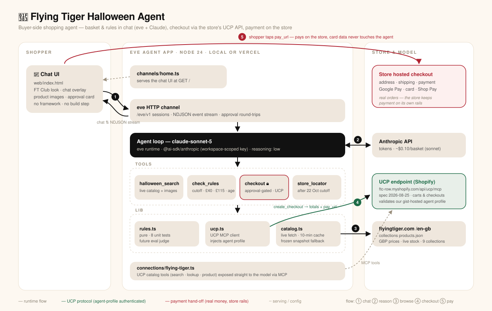
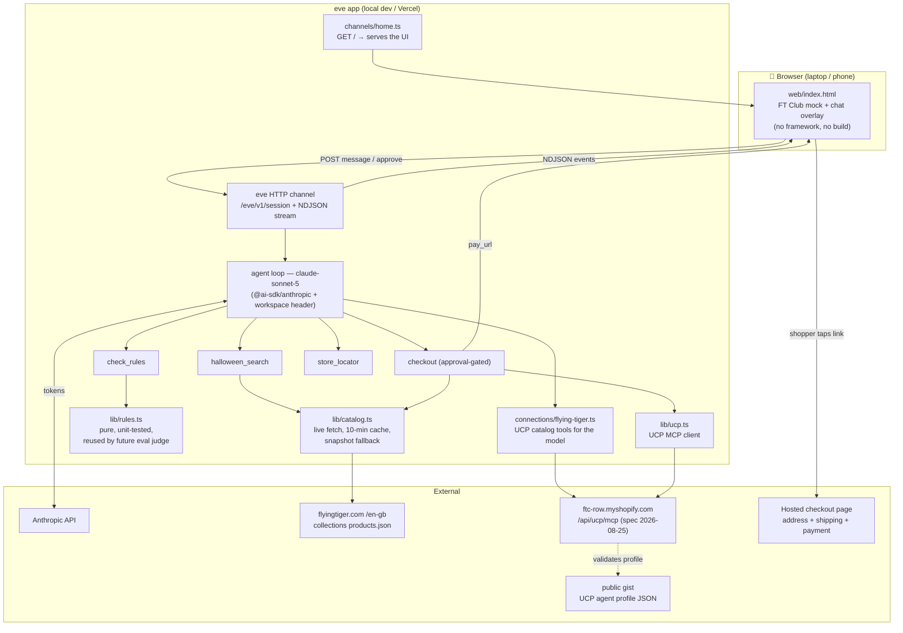

# 🎃 Flying Tiger Halloween Agent — local MVP

A buyer-side shopping agent for the **Flying Tiger Copenhagen GB storefront's Halloween collections**, built on [eve](https://eve.dev) (pinned 0.71.2). It searches the live catalog, builds a basket under the store's own rules, asks for approval, and creates a **native checkout session via the store's UCP API** — authoritative totals and accepted payment options (Google Pay, card, Shop Pay) shown in chat, ending in the store's hosted checkout URL for address, shipping, and payment. Card data never enters the chat (the store only accepts wallet/tokenized payments from agents, so there is nothing a typed card number could do).

Useful until **22 October 2026** (the "order by" date for Halloween delivery); after that the agent refuses delivery baskets and points to the store locator.

## Run it

```bash
# one-time: paste your key
echo 'ANTHROPIC_API_KEY=sk-ant-…' > .env

npm run dev            # terminal REPL + http://localhost:2000
```

Open **http://localhost:2000** — a mock of the Flying Tiger Club app's voucher screen (decorative, non-clickable). Tap the spinning 🎃 button on the right to open the agent chat.

**Phone on the same Wi-Fi** (localDev auth is env-gated, so LAN is fine, but the server binds loopback by default):

```bash
npm exec -- eve dev -- --host 0.0.0.0
# then open http://<laptop-ip>:2000 on the phone
```

Try: *“Trick or treat bags for 8 kids under £25, delivered by Halloween.”*
Then: *“I'm ordering on 25 October, party stuff for 10”* → expect the cutoff refusal + store locator.

## How it works

| Piece | What |
|---|---|
| `agent/instructions.md` | The store's rules: 22 Oct cutoff, free shipping ≥ £40 (never pad the basket), £115 import-duty warning, stock re-check, under-3 age rule, never invent products/prices, automated-agent disclosure |
| `agent/tools/halloween_search.ts` | Live search over the nine Halloween collections (`products.json`, 10-min cache, committed snapshot as offline fallback) |
| `agent/tools/check_rules.ts` | Deterministic rules check — pure function in `agent/lib/rules.ts`, unit-tested, reusable as the future eval judge |
| `agent/tools/checkout.ts` | **Approval-gated (first use).** Re-checks live stock, creates a UCP checkout session (`agent/lib/ucp.ts`), relays the store's totals + payment options + hosted pay URL; falls back to a cart permalink if UCP is down |
| `agent/connections/flying-tiger.ts` | The store's official **UCP MCP endpoint** (catalog tools only). The required hosted agent profile + the empirically derived recipe: `docs/findings.md` §1 |
| `web/index.html` | The whole UI — Club-app mock + chat overlay, plain HTML/JS, no build step, served by `agent/channels/home.ts` |
| `scripts/snapshot_catalog.ts` | Frozen dated catalog → `data/halloween-<date>.json` (315 variants, 2026-10-06). Re-run: `node scripts/snapshot_catalog.ts $(date +%F)` |

Tests: `node --test agent/lib/rules.test.ts` (six edge cases from the brief: £38, £120, 25 Oct, make-up for a 2-year-old, sold-out item, impossible budget).

## Deliberately out of scope (MVP)
Payments/wallets, deploy, eval harness (20 cases × 4 models — next phase; `lib/rules.ts` is judge-ready), memory, accounts, cron. **v2 idea:** replace the chat page with the MishiPay Scan&Go webapp shell.

## 📦 New: the SDK experiment

The MVP below generalizes into a **plug-and-play shopping-agent SDK** — any UCP/Shopify store becomes a brand-owned agent via one config file and a 2-line embed snippet. Proven live on Flying Tiger **and MUJI US**. See **[sdk/README.md](sdk/README.md)**.

## Architecture



Numbered flow: ① shopper chats ② agent reasons on Claude ③ browses the live GBP catalog ④ creates a real checkout via UCP ⑤ shopper pays on the store's own page.

<details>
<summary>Mermaid source (editable version of the same diagram)</summary>


</details>

Snapshot (`data/halloween-<date>.json`) sits under `lib/catalog.ts` as the offline fallback and the future eval's frozen ground truth.

## eve: what it bought us, what it cost us

| Gained | Lost / paid |
|---|---|
| The whole agent runtime for free: model loop, durable sessions, NDJSON streaming protocol, steering, cancellation | Pre-1.0 framework (pinned 0.71.2) moving fast; docs lag the code — port, interface binding, and static-file behavior all had to be verified against source |
| Tools = one TS file with a zod schema; input validation and discovery handled | No static file serving in production builds (`publicAssets: []`) — HTML must be inlined or fs-read (dev-only) |
| **Human approval gates as a one-liner** (`approval: once()/always()`) incl. the stream events and resume plumbing | eve's `anthropic()` helper couldn't pass custom headers — our user-scoped key forced a drop to `@ai-sdk/anthropic` directly |
| MCP connections as config, with `providedArguments` to inject the UCP agent profile app-side (model never sees it) | Default auth stack 401s all browsers in production — a public deploy needs a custom AuthFn (demo lock) |
| Same-origin custom channel for our UI → zero CORS, zero extra hosting | The loop itself is a black box: fine for this demo, less control than hand-rolling if we ever need exotic turn logic |
| Hot reload across tools/prompt/connections; terminal REPL; one-command Vercel deploy | Session cost controls exist (`limits`) but eval harness remains unexplored |

## UCP: what it bought us, what it cost us

| Gained | Lost / paid |
|---|---|
| **Authoritative store data in-chat**: GBP minor-unit prices, live availability, images, straight from the merchant | The agent-profile gate: undocumented, reverse-engineered from error messages; requires hosting a public JSON with exact content-type |
| Real server-side cart/checkout sessions: synced totals, 30-day expiry, session deep-link (`continue_url`) into hosted checkout | **This store escalates address/shipping/payment to its hosted page** (`requires_escalation`, extension interaction) — native checkout stops at items + totals |
| A standard: the same client code works against any UCP merchant; payment handlers/capabilities are machine-discoverable | No collection scoping in `search_catalog` — "Halloween only" still needs our own catalog filter (products.json/snapshot) |
| Future-proof: when the store enables agent-side address/payment, we are one `update_checkout`/`complete_checkout` call away | Rate limits undocumented; spec itself is young (three versions served side-by-side) |
